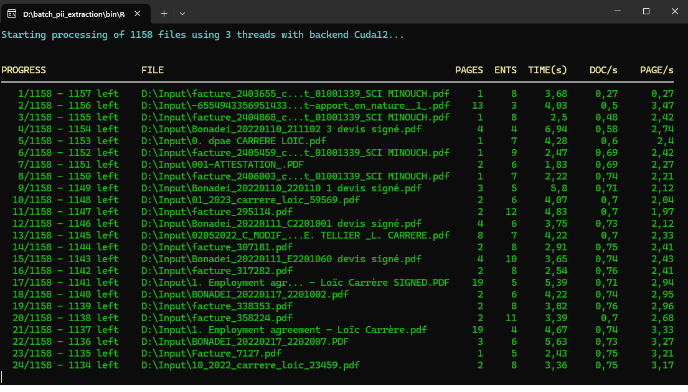

# Batch PII Extraction

A high-throughput demo for extracting Personally Identifiable Information (PII) from large document collections using LM-Kit.NET, with parallel processing and real-time performance metrics.

## Features

- **Batch processing** of entire directory trees with automatic subfolder traversal
- **Parallel extraction** with auto-tuned thread count based on available GPU memory
- **Real-time statistics**: documents/sec, pages/sec, and per-document timing
- **JSON output** preserving input directory structure
- **Multiple OCR backends**: Tesseract, AWS Textract, or custom implementations
- **Configurable inference modality**: Text or Vision modes
- **Custom entity definitions** for domain-specific PII types
- **Guidance prompts** for context-aware extraction

## Prerequisites

- .NET 8.0 or later
- LM-Kit.NET SDK
- Tesseract OCR (included via `LMKit.Integrations.Tesseract`)
- Sufficient VRAM for parallel inference (8+ GB recommended for multi-threaded processing)

## Configuration

Edit `Configuration.cs` to customize behavior:

```csharp
// Model selection (see full catalog at docs.lm-kit.com)
public static string ModelId = "lmkit-tasks:4b-preview";

// Inference mode: Text (faster, better for redaction) or Vision
public static InferenceModality PreferredInferenceModality = InferenceModality.Text;

// Include catch-all "Other" entity type
public static bool IncludeOtherType = false;
```

### Thread Count

Thread count is automatically determined based on GPU memory:
- **>8 GB VRAM**: 2–3 threads (depending on model size)
- **≤8 GB VRAM**: 1 thread

### Custom Entity Definitions

Add domain-specific PII types:

```csharp
engine.PiiEntityDefinitions.Add(
    new PiiExtraction.PiiEntityDefinition("swift code"));
```

### Extraction Guidance

Provide context to improve detection:

```csharp
engine.Guidance = "consider swift code as private information";
```

### OCR Engine Options

```csharp
// Tesseract (default)
engine.OcrEngine = new TesseractOcr();

// AWS Textract
engine.OcrEngine = new TextractOcr(
    "awsAccessKeyId", 
    "awsSecretAccessKey",
    AWSRegion.EUCentral1);

// Custom implementation
engine.OcrEngine = new MyCustomOcr();
```

## Usage

1. Set input/output directories in `Program.cs`:
   ```csharp
   const string InputDirectory = @"D:\Input";
   const string OutputDirectory = @"D:\Output";
   ```

2. Run the application

3. Monitor real-time progress:



4. Retrieve JSON results from the output directory

## Console Output

The application displays a live table with:

| Column | Description |
|--------|-------------|
| **PROGRESS** | Current file count and remaining |
| **FILE** | Document path (truncated for display) |
| **PAGES** | Number of pages in document |
| **ENTS** | PII entities detected |
| **TIME(s)** | Processing time for this document |
| **DOC/s** | Cumulative document throughput |
| **PAGE/s** | Cumulative page throughput |

## Output Format

Each processed file generates a corresponding JSON file:

```
Input:  D:\Input\contracts\agreement.pdf
Output: D:\Output\contracts\agreement.json
```

```json
[
  {
    "Type": "Name",
    "Value": "John Smith",
    "Confidence": 0.95
  },
  {
    "Type": "Email",
    "Value": "john.smith@acme.com",
    "Confidence": 0.98
  }
]
```

## Supported Formats

- **Documents**: PDF, DOCX, XLSX, PPTX
- **Images**: PNG, JPG, TIFF, BMP, WebP
- **Text**: TXT, CSV, RTF

## Performance

Benchmark on 1,158 mixed documents (invoices, employment contracts, attestations):

| Metric | Value |
|--------|-------|
| Backend | CUDA12 |
| Threads | 3 |
| Avg. time/document | 2.5–7 s |
| Document throughput | 0.5–0.75 doc/s |
| Page throughput | 2.5–3.5 pages/s |

At completion, view aggregate statistics:

```
Summary: 1158 documents, 4832 pages | Total: 28 min 15.42 s | Avg/doc: 00:02.93 | Avg/page: 00:00.35 s | Throughput: 0.68 doc/s, 2.85 page/s
```

## Use Cases

- **Compliance audits**: Scan document repositories for GDPR/CCPA compliance
- **Data migration**: Identify sensitive data before cloud migration
- **Redaction pipelines**: Generate entity locations for automated redaction
- **Risk assessment**: Quantify PII exposure across file shares

## Inference Modality

| Mode | Best For | Speed |
|------|----------|-------|
| **Text** | Scanned documents, redaction workflows | Faster |
| **Vision** | Complex layouts, forms, mixed content | More accurate |